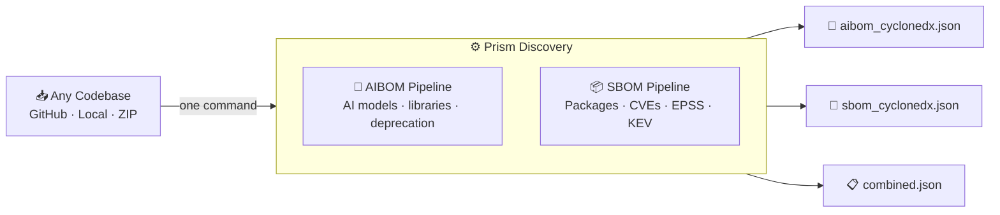
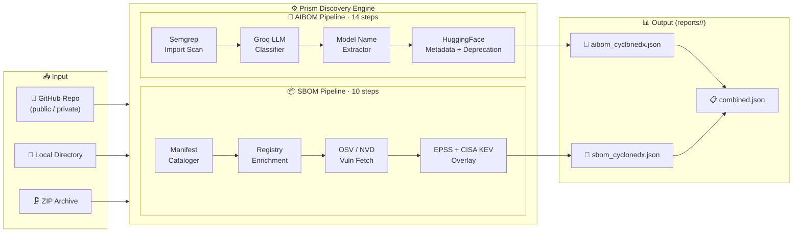
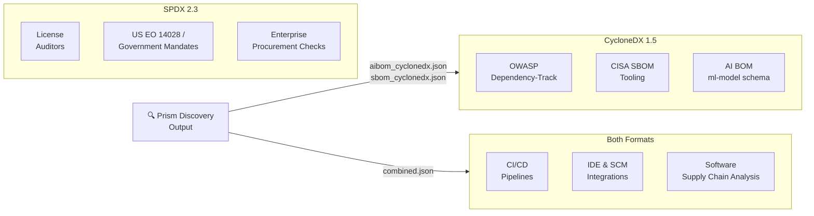

<div align="center">

# 🔍 Prism Discovery

### Unified AI Bill of Materials (AIBOM) + Software Bill of Materials (SBOM) Scanner

**Scan any codebase. Know every AI model. Know every vulnerable dependency.**

> Developed and maintained by [SISA Information Security](https://sisa.ai) · Hosted version with dashboards, team collaboration, and enterprise integrations available at **[prism.sisa.ai](https://prism.sisa.ai/)**

[Quick Start](#quick-start) · [Installation](#installation) · [CLI Reference](#cli-reference) · [How It Works](#how-it-works) · [Contributing](#contributing)

</div>

---

## What is Prism Discovery?

Prism Discovery is an open-source command-line tool that scans codebases and produces two critical security artefacts in a single run:

| Output | What It Tells You |
|---|---|
| **AIBOM** — AI Bill of Materials | Which AI/ML libraries are in use, which models are called, their metadata (parameters, license, context window), and which ones are deprecated |
| **SBOM** — Software Bill of Materials | All software dependencies with license data, CVE vulnerabilities, EPSS exploitability scores, and CISA KEV status |

Works with **GitHub repositories**, **local directories**, and **ZIP archives**.  
Supports **Python, JavaScript/TypeScript, Go, .NET, and Java** and many more.

---

## Try Prism at prism.sisa.ai

Prism Discovery is one of the open-sourced products of SISA AI Prism **[prism.sisa.ai](https://prism.sisa.ai/)** — SISA's hosted security intelligence platform for AI-aware software supply chain management.


> **[Visit prism.sisa.ai →](https://prism.sisa.ai/)** — Scan directly from your browser. No setup, no API keys to manage.

---

## Open Source vs. Full Platform

This open-source release covers the **core scanning engine** for AIBOM and SBOM. The full **[prism.sisa.ai](https://prism.sisa.ai/)** platform extends it with deeper AI-supply-chain intelligence and enterprise workflows that are **not** included in this repository:

### AIBOM — extra capabilities on the hosted platform

| Feature | Open Source | Full Platform |
|---|---|---|
| Detect AI/ML libraries and models in code | ✅ | ✅ |
| Basic model metadata (parameters, license, context window) | ✅ | ✅ |
| **Full model card details** (training data, evaluation, bias, intended use, limitations) | — | ✅ |
| **Comprehensive model deprecation tracking** across all major providers | Partial (HuggingFace) | ✅ All providers |
| **AI agents detection** — frameworks, orchestrators, tool use | — | ✅ |
| **AI API call mapping** — which endpoints, models, providers your code is calling | — | ✅ |
| **MCP (Model Context Protocol) usage detection** | — | ✅ |
| **MCP server + agent capability mapping** — what tools / data each agent or MCP can reach | — | ✅ |

### SBOM — extra capabilities on the hosted platform

| Feature | Open Source | Full Platform |
|---|---|---|
| Manifest parsing, CVE / EPSS / KEV enrichment | ✅ | ✅ |
| **Guided vulnerability remediation** — fix paths, version pinning advice, patch impact | — | ✅ |
| Web dashboards, scan history, team collaboration, CI/CD integrations, scheduled scans, PDF/CSV export, policy alerting, enterprise SLA | — | ✅ |

> 💬 **Need the full platform?** Reach out to us at **[prism.sisa.ai](https://prism.sisa.ai/)** for a demo, pricing, or a private trial.

---

## How It Works

### Overview

Prism Discovery accepts a GitHub URL, local directory, or ZIP archive and runs two independent pipelines in a single pass. The **AIBOM pipeline** uses Semgrep static analysis and a Groq LLM classifier to identify every AI/ML library in the codebase, traces which source files consume them, and extracts the exact model names being called — then enriches each with metadata (parameters, license, deprecation status) from HuggingFace Hub and other registries. The **SBOM pipeline** parses package manifests across every major language ecosystem, enriches each dependency with registry data, and overlays CVE vulnerabilities with EPSS exploitability scores and CISA KEV status. Both pipelines run from a single command and write into a shared in-memory store — no server, no database, no daemon required.



---

### Architecture



### AIBOM
- Detects AI/ML libraries across Python, JavaScript, Go, .NET, and Java
- Classifies libraries into AI providers, orchestration frameworks, vector DBs, agentic frameworks, and more
- Traces exactly which source files use each AI library through a file-level dependency graph
- Runs provider-specific Semgrep rules to extract model names, API endpoints, and SDK method calls
- Resolves model metadata (parameters, architecture, datasets, metrics, license, context window) from **HuggingFace Hub**
- Checks model deprecation status against HuggingFace and OpenAI deprecation databases with full replacement chain tracing
- Emits a **CycloneDX AI BOM** (standard format)

### SBOM
- Parses manifests across all major ecosystems: pip, npm, go.mod, NuGet, Maven, Gradle, Cargo, RubyGems, Composer, CocoaPods, and more
- Enriches packages with license, homepage, and release date from registries
- Queries **CVE, OSV DATABASES** (primary) and NVD (fallback) for CVEs
- Adds **EPSS exploitability score** and **CISA KEV status** per vulnerability
- Generates **CycloneDX 1.5**, and a custom JSON report with actionable remediation guidance

---

## Requirements

| Dependency | Version | Purpose |
|---|---|---|
| Python | 3.10+ | Runtime |
| [Semgrep](https://semgrep.dev/docs/getting-started/) | Latest | Import detection & model name extraction |
| [Groq API key](https://console.groq.com/) | Free tier | LLM-powered library classification |
| [HuggingFace token](https://huggingface.co/settings/tokens) | Optional | Gated model metadata |

---

## Installation

```bash
# 1. Clone the repository
git clone https://github.com/SISAReshma/Prism_Discovery.git
cd Prism_Discovery/app

# 2. Create and activate a virtual environment
python -m venv .venv
source .venv/bin/activate        # Windows: .venv\Scripts\activate

# 3. Install Python dependencies
pip install -r requirements.txt

# 4. Install Semgrep (required for import detection and model scanning)
pip install semgrep
# or: brew install semgrep  (macOS)
```

Create a `.env` file in the `app/` directory:

```bash
# Required
GROQ_API_KEY=gsk_...

# Optional — enables gated model metadata from HuggingFace Hub
HF_TOKEN=hf_...
```

---

## Quick Start

```bash
# Scan a public GitHub repository (AIBOM + SBOM)
python cli.py --repo https://github.com/openai/whisper

# Scan a private repository with a GitHub PAT
python cli.py --repo https://github.com/your-org/your-repo --token ghp_xxxx

# Scan a local project folder
python cli.py --local ./my_project

# Scan a ZIP archive
python cli.py --zip ./project.zip

# Only AIBOM (skip SBOM)
python cli.py --local ./my_project --mode aibom

# Only SBOM (skip AIBOM)
python cli.py --local ./my_project --mode sbom

# Custom output directory
python cli.py --repo https://github.com/openai/whisper --reports-dir ./scans
```

## CLI Reference

```
python cli.py (--repo REPO | --local LOCAL | --zip ZIP) [options]
```

| Argument | Required | Description |
|---|---|---|
| `--repo REPO` | One of three | Public or private Git repository URL (HTTPS or SSH) |
| `--local LOCAL` | One of three | Path to a local project directory |
| `--zip ZIP` | One of three | Path to a `.zip` archive |
| `--token TOKEN` | No | GitHub Personal Access Token for private repositories |
| `--username USERNAME` | No | Username for providers that require basic auth alongside `--token` |
| `--mode {both,aibom,sbom}` | No | Which pipeline(s) to run — default: `both` |
| `--reports-dir REPORTS_DIR` | No | Output directory for reports — default: `reports/` |

---

## Environment Variables

### Required

| Variable | Description |
|---|---|
| `GROQ_API_KEY` | Groq API key — powers LLM-based library classification |

### Optional — AI Enrichment

| Variable | Description |
|---|---|
| `HF_TOKEN` | HuggingFace token — enables gated model card access |
| `REPLICATE_API_TOKEN` | Replicate API token — for Replicate-hosted model metadata |


## Supported Languages

| Language | Extensions | Manifest Files |
|---|---|---|
| **Python** | `.py` `.pyx` `.pyi` `.ipynb` | `requirements.txt`, `pyproject.toml`, `setup.py`, `setup.cfg`, `Pipfile` |
| **JavaScript / TypeScript** | `.js` `.jsx` `.ts` `.tsx` `.mjs` `.cjs` | `package.json`, `package-lock.json` |
| **Go** | `.go` | `go.mod`, `go.sum` |
| **.NET (C# / F# / VB)** | `.cs` `.fs` `.vb` | `*.csproj`, `packages.config`, `Directory.Packages.props` |
| **Java** | `.java` | `pom.xml`, `build.gradle`, `build.gradle.kts` |
| **Rust** | `.rs` | `Cargo.toml`, `Cargo.lock` |
| **Ruby** | `.rb` | `Gemfile`, `Gemfile.lock` |
| **PHP** | `.php` | `composer.json`, `composer.lock` |
| **Swift** | `.swift` | `Package.swift` |
| **Conda / Anaconda** | — | `environment.yml` |
| **C / C++** | `.c` `.cpp` `.h` `.hpp` | `conanfile.txt`, `CMakeLists.txt`, `vcpkg.json` |


## Output Files

All output is written to `reports/<scan_number>/`:

```
reports/
└── 1/
    ├── aibom_cyclonedx.json   ← CycloneDX AI BOM
    ├── sbom_cyclonedx.json    ← CycloneDX Software BOM
    └── combined.json          ← Merged summary
```

### `aibom_cyclonedx.json`

CycloneDX AI BOM — each detected AI model is a component:

```json
{
  "bomFormat": "CycloneDX",
  "specVersion": "1.5",
  "components": [
    {
      "type": "machine-learning-model",
      "name": "whisper-large-v3",
      "version": "1.0",
      "author": "OpenAI",
      "description": "Whisper is a general-purpose speech recognition model...",
      "pipelineTag": "automatic-speech-recognition",
      "license": "MIT",
      "contextWindow": null,
      "deprecated": false,
      "parameters": "1550M",
      "datasets": ["Common Voice", "VoxPopuli", "LibriSpeech"],
      "trainingCutoff": "September 2022"
    }
  ]
}
```

### `sbom_cyclonedx.json`

CycloneDX 1.5 Software BOM — each dependency with PURL, license, version, and associated CVEs.

### `combined.json`

Merged summary of both reports:

```json
{
  "scan_id": "1",
  "project_name": "whisper",
  "aibom": {
    "models_detected": 6,
    "models_found": 5,
    "deprecated_count": 1,
    "ai_libraries": ["openai", "torch", "tiktoken"],
    "categories": { "DL_ALGORITHM": 2, "AI_PROVIDER": 1 }
  },
  "sbom": {
    "packages_count": 12,
    "vulnerabilities_count": 2,
    "critical": 0,
    "high": 1,
    "medium": 1
  }
}
```

---

### CycloneDX 1.5 — chosen for security and AI

CycloneDX is purpose-built for security use cases. Version 1.5 introduced the `ml-model` component type — **the only standardised schema that can describe AI/ML models inside a BOM**. Without it, an SBOM has no way to represent model parameters, training data, deprecation status, or provider metadata. Every AIBOM Prism generates uses this schema.

CycloneDX is also the native format for OWASP Dependency-Track, CISA SBOM tooling, and most modern supply chain security platforms.


### At a glance




---

## Contributing

Contributions are welcome! Here's how to get started:

1. **Fork** the repository and create a feature branch: `git checkout -b feat/your-feature`
2. **Run a test scan** on a sample repository to verify your changes end-to-end
3. **Check branding** — the tool name is `Prism Discovery`; keep logger names as `prism_discovery.*`
4. **Open a pull request** — describe what you changed and why, and include sample output if relevant

---

## License

Apache 2.0 — see [LICENSE](LICENSE) for details.
